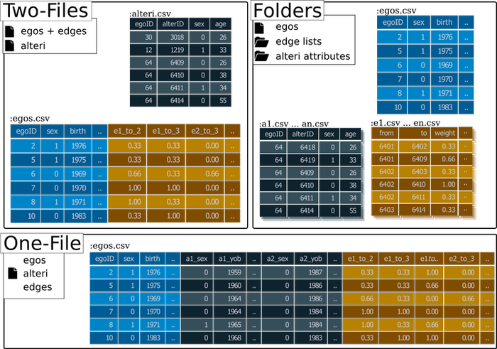

Ego-centererd network data includes three kinds of data:

1. Ego data
2. Alteri data
3. Edge data

The inforamtion on the **egos** is usually stored in a `dataframe`.

**Alteri** data can be stored in a 
single `dataframe` with the alteri as the rows (long-format), the data might be 
split up into seperate files for each ego/ network or it might be in the same 
dataset as the egos data, with the alteri information in colums _or_ as 
variables (wide-format.)

Finally the **edges** can be stored as edgelists (in one or in seperate files), as
matrices or in colums of a `dataframe` (wide-format).

`egonetR` helps with the importing of all these formats into R, by 
providing seperate functions that are dedicated to handle each kind of format.
In addition there are three funtcions that let you import all of the data in one
line of code:

## Single Command Import
`egonetR` supports importing three different data formats with a single command.
These are:

- **One-File**: All the data is stored in one file; egos as rows; alteri and edge data
in the wide-format.

- **Two-Files**: Ego data and edges (wide-format) are stored in one file and the
alteri (long-format) in another.

- **Folders**: Egos in one file; folders of files per ego for alteri and edges.


*Formats that can be imported using Single Command Import*

### One- & Two-File(s) Format

In order to import data stored in the One- or Two-File(s) format you need to 
load the datasets intro R first. If your data is stored as .csv-Files, use the
`read.csv()` or `read.csv2()` command.

**One-File:**


```{r, eval = TRUE}
setwd(system.file("extdata", package = "egonetR"))

egos_one <- read.csv2("one_file_8.csv")
```
    

**Two-Files:**
```{r}
setwd(system.file("extdata", package = "egonetR"))

egos_two <- read.csv2("two_files_8_egos.csv")

alteri_two <- read.csv2("alteri_8.csv")
```

    

    read.egonet.one.file(egos, netsize,  netID = "netID", attr.start.col, attr.end.col, dy.max.alteri, dy.first.var)
    
    read.egonet.two.files(egos, long, netsize = NULL,  netID = "netID", alterID = NULL, dy.max.alteri, dy.first.var)

    read.egonet.folders(egos, alter.folder, edge.folder, netID = "netID")


*Functions providing Single Command Import*