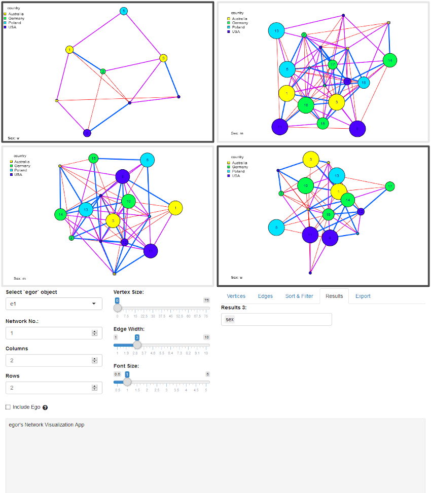

```{r setup, include = FALSE}
knitr::opts_chunk$set(
  collapse = TRUE,
  comment = "#>",
  dev.args = list(type = "cairo")
)

library(knitr)
library(egor)
```

## The `egor` Package

egor provides

- import functions
- egor object organizes ego-centered network, allowing for a smooth workflow
- dplyr methods: enable tidy data analysis strategies
- descriptive analysis (network composition, density, homophily, diversity)
- visualisation (clustered graphs, egographs, egogram)
- interacitve visualisation app

An `egor` object contains all data levels associated with ego-centered network 
analysis, those levels are: ego, alter, alter-alter ties. By providing the 
`egor()`-function with `data.frames` containing data corresponding to these data
levels, we construct an egor object. Here is an example of what the `data.frames`
could look like. Pay attention to the ID variables connecting the levels with 
each other. 

```
library(egor)
```

```{r}
data("alters32")
data("egos32")
data("aaties32") 
```

```{r echo=FALSE}
alters32 %>%
  head() %>%
  kable(caption = "First rows of alter data.")

egos32 %>%
  head() %>%
  kable(caption = "First rows of ego data.")

aaties32 %>%
  head() %>%
  kable(caption = "First rows of alter-alter tie data.")
```

All three `data.frames` contain an egoID identifying a unique ego and connecting
their personal data to the alter and alter-alter tie data. The alterID is in the
alter data is reused in the alter-alter tie data in the Source and Target 
columns.

Let's create an egor object from the data we just loaded.
```{r}
e1 <- egor(alters = alters32,
           egos = egos32,
           aaties = aaties32,
           ID.vars = list(
             ego = ".EGOID",
             alter = ".ALTID",
             source = ".SRCID",
             target = ".TGTID"))
e1
```

An [`egor`] object is a [`list`] of three [`tibbles`], named "ego", "alter" and "aatie", containg ego, alter and alter-alter tie data.

## Import

There are currently three importing functions that read the data exported from
data collection tools from the harddrive and load them as an `egor` object.

```
read_openeddi()
read_egoweb()
read_egonet()
```

In addition there are three functions that help with the transformation of common data 
formats of ego-centered network data into egor objects:


```
onefile_to_egor()
twofiles_to_egor()
threefiles_to_egor()
```

## Manipulate

Manipulating an egor object can be done with base R functions or with `dplyr` verbs.

### Base R

The different data levels of an egor object can be manipulated using square
bracket subsetting or the `subset()` function.

Ego level:

```{r}
e1[e1$ego$age.years > 35, ]
```

Alter level:
```{r}
subset(e1, e1$alter$sex == "w", unit = "alter")
```

Alter-alter tie level:
```{r}
subset(e1, e1$aatie$weight > 0.5, unit = "aatie")
```

### activate() and dplyr verbs

An `egor` object can be manipulated with dplyr verbs. Using the activate()
command, the data level to execute manipulations on, can be changed. This concept
is borrwed from the tidygraph package.

If the manipulation leads to the deletion of egos, the respective alters and
alter-alter ties are deleted as well. Similarly deletions of alters lead to
the exclusion of the alter-alter ties of the deleted alters.

```{r}
e1 %>% 
  filter(income > 36000)

e1 %>% 
  activate(alter) %>% 
  filter(country %in% c("USA", "Poland"))

e1 %>% 
  activate(aatie) %>% 
  filter(weight > 0.7)
```


## Analyse
Try these function to analyse you `egor` object.

### Summary
```{r}
summary(e1)
```

### Density
```{r}
ego_density(e1)
```

### Composition
```{r}
composition(e1, "age") %>%
  head() %>%
  kable()
```

### Diversity
```{r}
alts_diversity_count(e1, "age")
alts_diversity_entropy(e1, "age")
```

### Ego-Alter Homophily (EI-Index)
```{r}
comp_ei(e1, "age", "age")
```

### EI-Index for Alter-Alter Ties
```{r}
EI(e1, "age") %>%
  head() %>%
  kable()
```

### Count attribute combinations in alter-alter ties/ dyads

```{r}
# return results as "wide" tibble
  count_dyads(
    object = e1,
    alter_var_name = "country"
  )

# return results as "long" tibble
  count_dyads(
    object = e1,
    alter_var_name = "country",
    return_as = "long"
  )
```


### `comp_ply()`
`comp_ply()` applies a user-defined function on an alter attribute and returns 
a numeric vector with the results. It can be used to apply base R functions like
`sd()`, `mean()` or functions from other packages.

```{r}
e2 <- make_egor(15, 32)
comp_ply(e2, "age.years", sd, na.rm = TRUE)
```

## Visualize

### Clustered Graphs
```{r}
data("egor32")

# Simplify networks to clustered graphs, stored as igraph objects
graphs <- clustered_graphs(egor32, "age") 

# Visualize
par(mfrow = c(2,2), mar = c(0,0,0,0))
vis_clustered_graphs(graphs[1:3], 
                     node.size.multiplier = 1, 
                     edge.width.multiplier = 1,
                     label.size = 0.6)

graphs2 <- clustered_graphs(make_egor(50, 50)[1:4], "country") 

vis_clustered_graphs(graphs2[1:3], 
                     node.size.multiplier = 1, 
                     edge.width.multiplier = 3,
                     label.size = 0.6,
                     labels = FALSE)
```


### `igraph` & `network` plotting

- `as_igraph()` converts an `egor` object to a list of igraph objects.
- `as_network()` converts an `egor` object to a list of network objects.

```{r}
par(mar = c(0, 0, 0, 0), mfrow = c(2, 2))
purrr::walk(as_igraph(egor32)[1:4], plot)
purrr::walk(as_network(egor32)[1:4], plot)
```


```{r fig.height=6, fig.width=8}
plot(egor32)
```

```{r fig.height=6, fig.width=8}
plot(make_egor(32,16), venn_var = "sex", pie_var = "country", type = "egogram")
```


### Shiny App for Visualization 

`egor_vis_app()` starts a Shiny app which offers a graphical
interface for adjusting the visualization parameters of the networks stored
in an `egor` object.

```
egor_vis_app(egor32)
```


## Conversions

With `as_igraph()` and `as_network()` all ego networks are transformed into a list of igraph/network objects.
